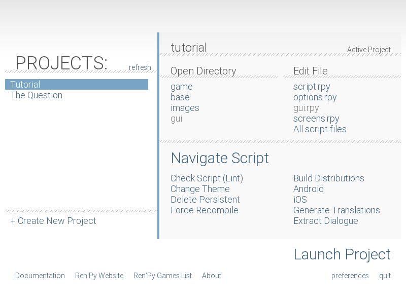
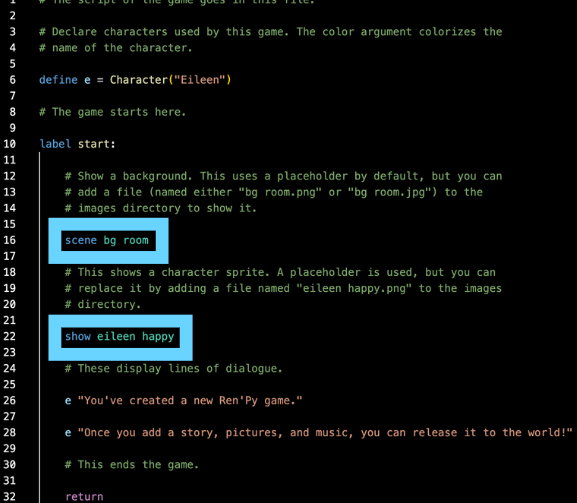

# Storyboard Ren'Py Guide Document
Hi everyone! It's Kat (@kat on Slack) and this is the written guide to How to Start Making a Ren'Py Game: adapted from the Ren'Py Quickstart Documentation & Shyla (@sprinkles on Slack)'s Ren'Py Tutorial Slideshow :D  (view her slideshow [here](https://www.canva.com/design/DAGwqnw-zrA/nUfHDVqLM1OQacNYaXwrtw/edit?utm_content=DAGwqnw-zrA&utm_campaign=designshare&utm_medium=link2&utm_source=sharebutton))

I made this guide (NO SHADE I LOVE YOUR SLIDE SM SHYLA IT'S JUST ME) because I prefer reading docs to slides/YT tutorials, but sometimes reading official documentation can be super hard & confusing, especially when they throw a bunch of terms at you that you don't understand 'cause you're a beginner D: as a certified ex-struggler, I decided to write this document to break the confusing documentation curse LOL & after this you should hopefully understand enough to look at the official documentation and (mostly) understand!!

If you ever need help, have questions, or are running into problems while creating your game, reach out on #storyboard, or DM me (@kat) or any of the other organizers on the Hack Club Slack! We're happy to help answer any questions you have :P 

> I (Kat) made this which means I get to license it! View the license <a href="/licensepage/">here :D</a>

## Table of Contents
Trying to find something? Here's a table of contents!
1. [Downloading VSCode](#before-we-start)
2. [Downloading Ren'Py](#step-1-download-renpy)
3. [Example Game](#step-2-lets-check-out-an-example-game)
4. [Creating Your Game](#step-3-creating-your-game)
    - [Ren'Py Launcher Tour](#renpy-launcher-tour-in-detail)
5. [VSCode Setup](#step-4-vscode-setup-continued)
6. [GitHub Setup](#step-5-github-desktop-setup)
7. [Time to Code!!](#step-6-time-to-code)
    - [Comments](#comments)
    - [Label Statements](#label-statements)
    - [Say Statements](#say-statements)
    - [Characters](#characters)
    - [Images](#images)
    - [Positions](#positions)
    - [Audio](#audio)
    - [Pausing & Ending Your Game](#pausing--ending-your-game)
    - [Let's Put It All Together!](#lets-put-it-all-together)
    - [Using Menu (Making Options for the Player)](#using-menu)
        - [Python & Variables in Menu](#python--variables-in-menu)
8. [Stuck? Here's some ideas for your game!](#step-7-hmm-what-else)
9. [You did it! + More Resources/Docs](#step-8-you-did-it--more-documentation-0)

## Before we start...
Download Visual Studio Code! (link [here](https://code.visualstudio.com/download))
- Not only does Visual Studio make coding SO MUCH EASIER with autocomplete, extensions, debugging, Git, and a built in Terminal, it also facilitates time tracking with Hackatime!
- click [here](https://www.canva.com/design/DAGwtXqXZN8/D1SXl-_I6ncKPsh8myZCrg/view?utm_content=DAGwtXqXZN8&utm_campaign=designshare&utm_medium=link2&utm_source=uniquelinks&utlId=hc24f03c5b7) to learn how to track your time coding for Storyboard with Hackatime :D
- there will be more about VSCode setup with Ren'Py after we download Ren'Py, but for now get Hackatime set up :D

## Step 1: Download Ren'Py
click [here](https://www.renpy.org/latest.html) 
for the download link!
### For Windows
- click "Download SDK 7z.exe"
- Double-click file
- Open folder "renpy-&lt;version>"
- Run renpy.exe (or renpy)
### For Linux
- Click "Download ARM Linux (Raspberry Pi and Chromebook) SDK tar.bz2"
- unpack tarball
- Go to "renpy-&lt;version>"
- Run renpy.sh
### For Mac
- Double-click file
- Drag renpy-<version> somewhere else
- Open it and run renpy!



This is what the Ren'Py launcher should look like when you download & open it.

## Step 2: Let's check out an example game!
When you open the Ren'Py launcher, under "Projects" there should be two tabs: "Tutorial" and "The Question." You want to click on "The Question" and then click "Launch Project" to play the visual novel!
When you're in the visual novel, you want to press Start to play the game, and when you want to exit, press esc on your keyboard, then press Quit.
### A quick refresher...
If you ever want a refresher on anything you learn, check out the Tutorial game! To open it, you want to click the "Tutorial" tab, then click "Launch Project".
Now that you know a bit about Ren'Py, wou can start making your very own visual novel!!
## Step 3: Creating your game
Exciting!! To make your game, Click "+ Create New Project" under the projects.
### Let's set the game up...
#### Language
- If accurate, press _Continue_
- Otherwise, click _preferences_ in the bottom right corner of the screen, change the language settings, and click Return
#### Name your project, then click _continue_ in the bottom right!
When Ren'Py asks you what you want your game resolution to be, select **1920x1080** and click _Continue_ (This is important because you'll want to make the canvas size of all your backgrounds 1920x1080 so your backgrounds fit your game!)
Next, select a project directory (aka any folder you want - or create one called RenPy games! this directory will house _all_ your future Ren'Py games as well.)
Then, choose a colour scheme! Select a colour and click _Continue_ in the bottom right. Don't stress too hard about this - you can always change the colours and designs of everything in your game later!
### Now that you've set up, your project name should be on the left sidebar with "Tutorial" and "The Question"!
If you don't see it, press _refresh_.
P.S. Don’t worry if you don’t see your color scheme, we’re not inside your game yet! We're still in the RenPy launcher.

Click _Launch Project_ In the bottom right corner. Another window with your game should open! 
- By default, this is your game's icon:
- 
- You can change it later!

Press _Quit_ to close your game D:

## Ren'Py Launcher Tour (in detail!)
Now, let's go through everything on the Ren'Py launcher screen and see what they do! You don't have to memorize this... just click on stuff and see what pops up! You'll learn after clicking enough things :D

Another picture of the Ren'Py launcher for reference:


There are three sections: Open Directory, Edit File, and Actions (or Navigate Script depending on which version of Ren'Py you have). Let's go through them one by one:
### Open Directory
There are five tabs: game, base, images, audio, and gui.
> #### game
>> this opens the game folder with all of the game's files!
> #### base
>> this opens a folder that CONTAINS the game folder with a few more files! (it also has the same name as your project :0)
> #### images
>> this is where you can add images to use in your game, such as backgrounds, character sprites, etc.!
> #### audio
>> this is where you can add audio to use in your game, such as sound effects & music!
> #### gui
>> GUI stands for Graphical User Interface, which is basically what lets users navigate your game using buttons & menus! The gui folder contains different buttons, icons, text boxes, etc. that are used in the GUI of your game.
### Edit File
There are five tabs: script.rpy, options.rpy, gui.rpy, screens.rpy, and All script files.
> #### script.rpy
>>  This opens script.rpy, the main script file you'll be coding in!
> #### options.rpy
>> This opens options.rpy, which has other settings about your game!
> #### gui.rpy
>> This opens gui.rpy. gui.rpy controls the elements we talked about in _gui_ before: buttons, icons, text boxes, etc. You can customize and code those elements with gui.rpy! 
> #### screens.rpy
>> Ren'Py is comprised of different screens, such as the main menu, the say screen (AKA the dialogue screen with characters), and the choice screen (AKA when players can choose dialogue options). If you wish to make your game interactive, you can make custom screens and code them here! If not, you don't have to worry about this part :D
### Navigate Script/Actions
There are 10 tabs: Navigate Script, Check Script (Lint), Change/Update GUI, Delete Persistent, Force Recompile, Build Distributions, Android, iOS, Web, Generate Translation, and Extract Dialogue. We're only covering a few of those in this document:
> #### Check Script (Lint)
>> This shows errors and some fun stats about your game!
> #### Change/Update GUI
>> You can use this to change the colour scheme you chose earlier to a different colour without needing to fiddle with the code in gui.rpy! However, if you have custom buttons/text boxes/other UI elements, they will be overwritten if you use this. D:
> #### Build Distributions
>> This is simply a title! It means that when you click the different options underneath it (Android, iOS, Web), Ren'Py will generate a finished playable _build_ of your game so you can _distribute_ it to the different platforms you picked. (Android, iOS, Web) For Storyboard, you will export for Web, but if you wish to export your game to other platforms, you can simply click all the different options to generate different builds! 
> #### Generate Translations
>> If you want to translate your game into other languages, you can generate translations directly in Ren'Py by clicking this.
> #### Extract Dialogue
>> If you need to see the dialogue from your game, you can extract it without having to fiddle with the code in script.rpy/transcribe the dialogue yourself by using this option!
Now that you know everything about the launcher, let's continue our VSCode setup and start coding! (yay!!)
## Step 4: VSCode Setup (continued)
Now, we're going to add your Ren'Py files to VS Code. We will find the folder with the same name as the (AKA base) and add it to VS Code!
1. open the Ren'Py launcher and click **base**
2. Ren'Py should have opened a folder with your game's name. Go to the directory (folder) that contains your base folder.
3. Drag your base folder into VSCode!
## Step 5: Github Desktop Setup
For Storyboard (+ this is good practice for coding in general), you **have** to use GitHub to store your project files. You can add changes, collaborate with others, and see your version history! If you already know how to setup Github & Github Desktop, go ahead on your own. If not, let's go through this together!
1. Download the GitHub Desktop app [here](https://desktop.github.com/download/)
2. Go to Github Web (their website, [github.com](https://github.com)) & create a new Repository by pressing the "+" button in the top-right corner. (+ sign up if you haven't already!)
3. Name your repository & add a description, README.md, and (optional) LICENSE.md!
4. Go back to Github Desktop: you're going to create a local clone of the repository you made on Github Web.
> Note: local = something that only exists on your device & cannot be accessed by anyone on the Internet! for example, if you take a picture on your phone, it will be local, but if you upload that photo to Instagram for your friends to see, the picture on Instagram will not be local anymore! When we make a local clone of the Github Web repository, we basically download all the files from Github Web onto our device.
5. open the Ren'Py launcher and click **base** Ren'Py should have opened a folder with your game's name!
6. copy all the contents of that folder (don't worry, we'll paste it soon!)
7. back to Github Desktop: press "View the files of your repository in Explorer". This will open a local folder that contains the clone of your repository! Now, paste the contents of your base folder into this folder.
8. go BACK to Github Desktop: you will see that the screen changed, as you added many new files! You want to **commit** these changes, and then **push** them back to your repository on Github Web. In the bottom-left corner of the window, there should be a few boxes asking you to write a summary and (optional) description. Quickly fill those boxes out, then press "commit to main". 
9. Next, in the top bar with "Current repository" and "Current branch," you'll see a button that says "Push to origin". This **pushes** your changes to the local clone you made back to Github Web, so everyone can see your changes! Press this button.
10. Go back to Github Web! Hopefully you'll see your changes to the web repository, and if they don't show up, try refreshing the page. You can also always reach out on the Hack Club Slack to #storyboard, or DM me (@kat) if things aren't working!
## Step 6: Time to Code!!
Setup is a lot of work, but now it's finally over!! It's time to start coding!! Make sure to open your files via VSCode, and check if your Hackatime is tracking. Save your project (ctrl+S or cmd+S) regularly to make sure nothing gets lost if your VSCode runs into an error unexpectedly. It'll automatically update the file & connect with Ren'Py!
### Open up script.rpy in VSCode
script.rpy is the main script of the game, where you'll be adding dialogue, options for the player, changing characters/backgrrounds, and switching between scenes. (again, make sure you're opening it through VSCode so your time gets tracked!!!) Let's go through a few concepts to help get a hang of coting in script.rpy.
### Comments
Comments are notes you can add to your code that won’t affect anything! 
You use them to explain what your code does, and separate sections of code, which makes your code easier to read :D

In Ren’Py, comments start with # like this: # Comment


### Label Statements
Label statements name a spot in the program. Add labels to skip to different parts of your game! (ex. good ending, bad ending, start)
- everything within a label MUST be indented.
> note: indents are SUPER important in Ren'Py! if your game suddenly stops working, it might be because you indented something wrong.
- **start** is a special label that runs when the game starts.
- here's an example of label start: 


### Say Statements
There are 2 types of say statements: 
- Narration: "This is what the narrator said!"
- Dialogue: "Karbohydrate" "This is what Karbohydrate said!" 
- When a character is saying something, you want to first put their name in quotation marks (or a constant that represents them), and then put what they say in another pair of quotation marks.
- You only need to add one pair of quotation marks for the narrator, because there is no name to put first. (it's just the narrator!)
If your (string dialogue or narration text has a quotation mark in it ("like this")), put a backslash \ before it.

For example:

“Karbohydrate” “My friend said \”I love Storyboard!”\\, and I’m thinking about joining!”


### Characters
Remember how I said you can use a constant that represents a character? Now let's go through that!

Imagine typing out every character’s name every single time. You would have to type that out SO many times... it'd be terrible. Instead, define characters at the top of script.rpy. Give them a name, accent color, and shortened name to type. this shortened name is often called a **constant** in coding. 
> note: constants are used throughout coding across various languages, not just Ren'Py!

for example: define k = Character(‘Kat’, color=“#ccccff”)


Here's an example script with everything we just learned!
```
define kr = Character("Karbohydrate", color="#f07cb6ff")
define kash = Character("Kashyap")

label start:
    kr "Yo Kash is that you??? Kashmoney???"
    kash "Uhh... My name isn't Kashmoney..."
    "What an awkward situation... looks like Karbohydrate got someone's name wrong... yikes"
```
Karbohydrate's name is shortened as kr, and Kashyap is shortened to kash to make writing dialogue easier. ``color="#f07cb6ff"`` means Karbohydrate's name will appear in pink! 

Because there's no character name in the last line, the narrator will say the last line!

> note: when you have multiple characters with the same starting letter, it's good to make their constant/shortened names different & distinguishable, so you can tell who's who at a glance & not make any confusing typos.
> for example:
> good constant names: kr (Karbohydrate), kash (Kashyap)
> bad constant names: ka (Karbohydrate), ks (Kashyap) (not only are the constants very similar, a and s are also right next to eachother on the keyboard, so it'll be super easy to make typos!!! D:)

> note: Wait, what's the difference between a constant and a variable?? (Variables are discussed [later](#python--variables-in-menu) in this document, but if you already sorta know what they are and are confused about the difference between the two, this might help!)
>
> Well, constants are defined *once* and cannot be changed throughout the game (like the Character constants we discussed earlier, the maximum amount of health in a healthbar, or the game title!), so their value stays *constant*, but variables can change throughout the game. (ex. amount of money/health a character has, the location of the character, a score, etc.)
>
> TLDR: both variables & constant are a little word/phrase you use to represent something! However, the value of the things variables represent vary, and the value of the things constants represent stay constant :D (the name kinda explains it lol)

### Images
Yay! Now our characters are speaking, but they... don't really exist... and there's no settings for them to be either... How do we solve this? With images! Let's add pictures to our *visual* novel :D

Each image has a name, which is made up of a tag and some attributes. Name your images accordingly!! (this will be elaborated upon in a bit, don't worry)
- In the image bg room, the tag is bg (short for background), and the attribute is room.
- In the image eileen happy, the tag is eileen (a character) and the attribute is happy.



If we add another eileen image called **eileen coffee**, and we want eileen coffee to show up onscreen, but **eileen happy** is already onscreen, **eileen coffee** will *replace* **eileen happy**. The same concept is applied in backgrounds: if we have **bg cafe**, but **bg room** is already onscreen, when we code in **bg cafe**, it will *replace* **bg room**.
So... that's great and all, but how do we add more pictures?

#### Adding More Images
Let's say in your visual novel your character Eileen goes to the cafe to meet up with her friend, Nico. You want to add a picture of Eileen with coffee, a picture of Nico, and a cafe background.
1. **Name your images**

Let's follow the Ren'Py naming conventions! For Eileen's coffee sprite, we first start with our tag, eileen. After that, because she's drinking coffee, we'll add coffee, so the full name of the image will be eileen coffee.webp (or any image format that renpy accepts! I'm using .webp in this example because .webp pictures load a bit faster than .png or .jpg, so I like to use them + reccomend you to use them too!!)
> note: characters must be .png, .webp, or .avif. 
>
> backgrounds must be .jpg, .jpeg, .png, .webp, or .avif. 

let's name Nico's sprite as well using these rules:
> characters must start with (characterName) as a tag, and then have any attributes you want.
>
> backgrounds must start with bg as a tag, and then have any attributes you want.
hopefully Nico is happy to see their friend! let's name the sprite nico happy.webp.

Let's keep following the naming conventions! We'll call the background bg coffee.webp.
2. **upload your images!!**
Now that we have the images, how do we add them to our game?? Well, we first have to add them to our image directory. (AKA folder) 
- let's go back to the Ren'Py launcher!
- click on _images_ to open your game's image folder.
- upload your correctly-named images to the folder!
- they should be able to be used in your game's code now :D
- now let's add them to our game!!!


3. **code your images into the game!**
Before we start, a quick note...
> note: let's say you uploaded an image called _amber super happy.webp_, but you don't wanna type allat... super happy? that's too wordy! Well, there's a solution for that! at the top of your code, you can write:
>
> `image amber happy = "amber super happy.webp"`
>
> so you can simply use _amber happy_ to use that image instead! 

Now that your images are in the folder, we can use them! There are a few ways to show, hide, and change images. Here are some examples:

> Remember:  **#** is a comment, so it won't affect the code.

#### Examples

```
scene bg room

# clears all images, shows “bg room.webp"

show eileen happy

#shows “eileen happy.webp”

scene bg cafe

#clears all images, shows “bg cafe.webp”

show eileen happy

#shows “eileen happy.webp”

show amber happy

#shows amber super happy.webp”

show nico happy

#shows “nico happy.webp”

show nico coffee

#there’s already an image with the tag nico, so nico coffee.webp” replaces nico happy.webp”

hide eileen

#removes image with eileen tag
```
There are a few more elements before we can have a nice scene for our visual novel. The characters appear onscreen, but they don't say anything! You can add dialogue in-between the characters' appearances. 

```
# defining characters for dialogue
define e = Character("Eileen")
define n = Character("Nico")
define a = Character("Amber")

label start:

    scene bg room
    # clears all images, shows “bg room.webp"

    show eileen happy
    #shows “eileen happy.webp”

    e "Wow I'm going outside today! Very shocking for a CS kid!"

    scene bg cafe
    #clears all images, shows “bg cafe.webp”

    show eileen happy
    #shows “eileen happy.webp”

    e "Hey guys!!"

    "Two people walk through the door, Nico and Amber. They're Eileen's friends from school, and they forced her to come outside after she was stuck coding inside for four days straight because they were concerned for Eileen's health."

    show amber happy
    #shows amber super happy.webp”

    a "I'm so glad you came today Eileen!!"

    show nico happy
    #shows “nico happy.webp”

    n "Yo imma go get some coffee real quick! Good to see you guys!"

    show nico coffee
    #there’s already an image with the tag nico, so nico coffee.webp” replaces nico happy.webp”

    n "Guys let's go somewhere else... this coffee is really bad..."

    hide eileen
    #removes image with eileen tag

    return
```
### Transitions
Pretty cool! Our game has visuals now!! There's still space for improvement though... Let's quickly add some transitions! :D
There are a lot of transitions in [this link](https://www.renpy.org/doc/html/transitions.html), but two common ones are *dissolve* and *fade*.

Here are a few examples... Get creative and definitely check out the link above! :D

Room background with fade transition:

```
scene bg room
with fade
```

Eileen happy with dissolve transition:

```
show eileen happy
with dissolve
```

Room background with fade transition and eileen happy with fade transition:

```
scene bg room

show eileen happy

with fade
```

Room background with fade transition and eileen
happy with dissolve transition:

```
scene bg room

with fade

show eileen happy

with dissolve
```

Room background with no transition and eileen
happy with dissolve transition:

```
scene bg room

with None

show eileen happy

with dissolve
```

It's quite self-explanatory, so get creative! There are so many transitions and ways to improve the visuals of your game with Ren'Py :D

### Positions
Images usually appear in the middle of the screen, which isn’t ideal when you have multiple characters in the same scene. By default, images are centered horizontally with their bottom edge aligned with the bottom of the screen.

Position options:
- left
- right
- center (default)
- truecenter (centered horizontally AND vertically)

examples: 

```
show eileen happy at left

show eileen happy at right

show eileen happy at center

show eileen happy at truecenter
```

### Audio
Another way to improve your game is adding music + SFX! It doesn't seem like much, but music & SFX actually help immerse players and make your game far more engaging!!
Add files to the audio folder:


1. Click on *audio*
2. Drag/copy+paste files into that folder! Audio files must be an .mp3, .opus, or ogg vorbis (.ogg)

& add this code whenever you want the music to play:
```
play music "audio/FILENAME.mp3"

# or:

play music FILENAME

# do you want a fade in + out effect? use this code:

play music FILENAME fadeout 1.0 fadein 1.0

# ^ this fades out the music for 1 second & fades it in for 1 second as well! you can adjust the time depending on what you want for your game :D

queue music FILENAME2

# ^ plays this audio after the previous one ends, hence it's in a queue

stop music

play sound FILENAME3

# ^ this is a sound effect & it doesn't loop!

```

[click me for extra resources! :O](https://www.renpy.org/doc/html/audio.html)

### Pausing & Ending Your Game
Pausing your game is pretty self-explanatory!
```
pause
# this makes the game pause until the user clicks.

pause 3.0
# this makes the game pause for 3 seconds!
```

End your game by simply writing *return*. before you end your game, you should probably say "the end," or have another indication to players that the game's ending! 

### Let's put it all together!
Here's some example code putting together everything we've learned so far. Your code obviously shouldn't be the exact same, but will definitely have some similar components like dialogue and switching between images! 
> note: MAKE SURE YOU INDENT AFTER *label start:* **!!!!** if you don't, your game won't work D:
```
# defining characters for dialogue
define e = Character("Eileen")
define n = Character("Nico")
define a = Character("Amber")

label start:
    play music startMusic

    scene bg room
    # clears all images, shows “bg room.webp"

    show eileen happy
    #shows “eileen happy.webp”
    with fade

    e "Wow I'm going outside today! Very shocking for a CS kid!"

    scene bg cafe
    #clears all images, shows “bg cafe.webp”

    show eileen happy
    #shows “eileen happy.webp”
    with dissolve

    e "Hey guys!!"

    "Two people walk through the door, Nico and Amber. They're Eileen's friends from school, and they forced her to come outside after she was stuck coding inside for four days straight because they were concerned for Eileen's health."

    show amber happy at left
    #shows amber super happy.webp”

    a "I'm so glad you came today Eileen!!"
    with fade

    show nico happy at right
    #shows “nico happy.webp”
    with fade

    n "Yo imma go get some coffee real quick! Good to see you guys!"

    show nico coffee at right
    #there’s already an image with the tag nico, so nico coffee.webp” replaces nico happy.webp”
    with dissolve

    n "Guys let's go somewhere else... this coffee is really bad..."

    hide eileen
    with dissolve
    play sound disgustedNico 

    return
```
This is a nice story, but it's not really a game yet. After all, it's not interactive! Let's add choices for players!

### Using Menu

This example asks the player if they want to go to the café or park. 
- If they choose café, the game jumps to the label cafe, and uses the code in that label. 
- If they choose park, the game jumps to the label park, and uses the code in that label.

With this, you can make branching storylines & different endings!!
> note: after writing *menu:*, you have to indent the different options!
```
menu:
    "Let's go to the cafe!"
        jump cafe
    "let's go to the park!"
        jump park

label cafe:
    scene bg cafe
    show kashyap coffee at right
    show karb at left
    kr "NO WAY IT'S KASHMONEY AGAIN"
    show kashyap concerned at right
    kash "what the heck..."

label park:
    scene bg park
    show nico at right
    show amber at left
    "Nico" "Amber let's skip around the park with joys and whimsy!!"
    "Amber" "Okay!!"
    "You" "NOO GUYS WAIT FOR ME D:"    
```
#### Python & Variables in Menu
Great! You learned about menus, but you can always add more...

Maybe you want to keep track of how many points or how much money a character has, or need to save an important decision that the player made for later. You can use Python to store these values in variables! Defining/updating variables should begin with $.

You can also use if/elif/else statements in Ren'Py instead of labels!
> note: remember to indent...

> note: Wait, what's the difference between a constant and a variable?? Well, constants are defined *once* and cannot be changed throughout the game (like the Character constants we discussed earlier, the maximum amount of health in a healthbar, or the game title!), so their value stays *constant*, but variables can change throughout the game. (ex. amount of money/health a character has, the location of the character, a score, etc.)
>
> TLDR: both variables & constant are a little word/phrase you use to represent something! However, the value of the things variables represent vary, and the value of the things constants represent stay constant :D (the name kinda explains it lol)
>
> P.S. yes this note was also said [earlier](#characters) when I was talking about defining characters... I just copy pasted it because it's important for both of these parts :'D

example (but with variables):
```
menu:
    "Let's go to the cafe!"
        $ location = "cafe"
    "let's go to the park!"
        $ location = "park"

if location == "cafe":
    scene bg cafe
    show kashyap coffee at right
    show karb at left
    kr "NO WAY IT'S KASHMONEY AGAIN"
    show kashyap concerned at right
    kash "what the heck..."

elif location == "park":
    scene bg park
    show nico at right
    show amber at left
    "Nico" "Amber let's skip around the park with joys and whimsy!!"
    "Amber" "Okay!!"
    "You" "NOO GUYS WAIT FOR ME D:"    
```

## Step 7: Hmm, what else??
Stuck on ideas for things to add to your game? Try:
- adding another ending! (or a sidequest!!)
- add a new character
- improve character/background design! (maybe team up with a cool artist? hack club is a great place 2 reach out and make new friends!)
- add/improve music + SFX
- add SFX to the UI (ex. a sound plays after clicking a button!)
- customize the GUI (dialogue box + buttons)
- customize the main menu!
- make a logo for your game :O

ideas from the Storyboard team <3 DM me (@kat, kat wang on HC Slack) if you have more ideas and wanna be on the official Storyboard document... (will give credit!)


## Step 8: YOU DID IT!! + More Documentation :0
Yippee!! You read through this whole (well, most of this) document!! Ren'py is capable of a **LOT** more than what's shown in this introductory tutorial though, so you should totally go through their [documentation](https://www.renpy.org/doc/html/index.html), especially if you have super creative ideas for your game!
You can learn how to customize [buttons and other assets](https://www.renpy.org/doc/html/gui.html), have [multiple characters talk at the same time,](https://www.renpy.org/doc/html/multiple.html), and more!!

When you're done your supercool game and want others to check it out, check out my [guide on how to ship your game on itch.io!](https://docs.google.com/presentation/d/1EVhaEfpMS_GuYQo0u2su8s9y8YBbK1J678x35hwhVvU/edit?slide=id.p1#slide=id.p1)

Feel free to ask for help in #storyboard or dm me (@kat, kat wang)/another Storyboard organizer on Hack Club Slack! Thanks again to Shyla (@sprinkles) for making the [original presentation](https://www.canva.com/design/DAGwqnw-zrA/nUfHDVqLM1OQacNYaXwrtw/edit?ui=eyJEIjp7IlAiOnsiQiI6ZmFsc2V9fX0) that I adapted into this document :D

Have fun making your games!!!
> the last note: remember to indent properly. 
>
>  ☆ sincerely, kat the (unofficial but should be official) indent fairy

\- kat & the storyboard team :3

this document is licensed under the MIT license. [see the full license here](/licensepage)

[⇧ back to top](#storyboard-renpy-guide-document)